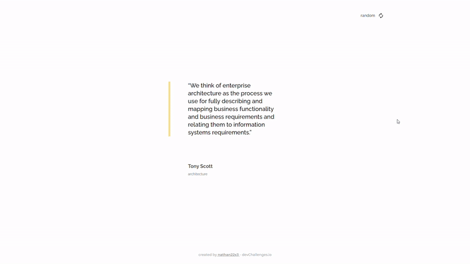

<!-- markdownlint-disable MD033 -->

<h1 align="center">
  
  Country quiz
</h1>

<div align="center">
   Solution for a challenge from  <a href="http://devchallenges.io" target="_blank">Devchallenges.io</a>.
</div>

<div align="center">
  <h3>
    <a href="https://random-quote-nathan22x3.surge.sh/">
      Demo
    </a>
    <span> | </span>
    <a href="https://devchallenges.io/solutions/hkX4UKc5oeTf0KbOKWsp">
      Solution
    </a>
    <span> | </span>
    <a href="https://devchallenges.io/challenges/8Y3J4ucAMQpSnYTwwWW8">
      Challenge
    </a>
  </h3>
</div>

## Table of Contents

- [Table of Contents](#table-of-contents)
- [Overview](#overview)
  - [Built With](#built-with)
- [Features](#features)
- [How To Use](#how-to-use)
- [Contact](#contact)

## Overview



### Built With

- [React](https://reactjs.org/)
- [Tailwind](https://tailwindcss.com/)

## Features

- [x] **User story**: You can see a random quote
- [x] **User story**: You can generate a new random quote
- [x] **User story**: When you select quote author, you can see a list of quotes from them
- [x] **User story**: You can see quote genre under the author

This application/site was created as a submission to a [DevChallenges](https://devchallenges.io/challenges) challenge. The [challenge](https://devchallenges.io/challenges/wP0LbGgEeKhpFHUpPpDh) was to build an application to complete the given user stories.

## How To Use

To clone and run this application, you'll need [Git](https://git-scm.com), [Node.js](https://nodejs.org/en/download/) and [Yarn](https://yarnpkg.com/getting-started/install) installed on your computer. From your command line:

```bash
# Clone this repository
$ git clone https://github.com/nathan22x3/random-quote

# Move to project's directory
$ cd random-quote

# Install dependencies
$ yarn

# Run the app
$ yarn start
```

## Contact

- GitHub [@nathan22x3](https://github.com/nathan22x3)
